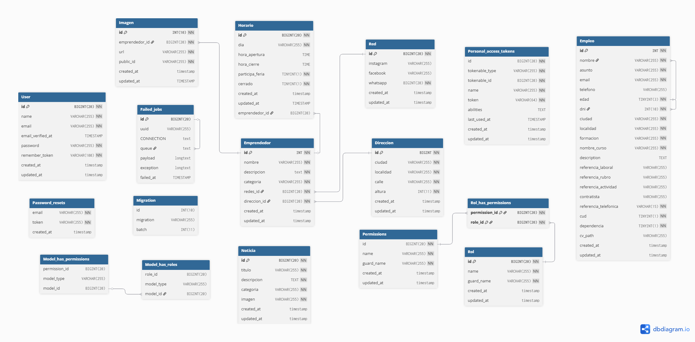

#_SITIO WEB PARA OFICINA DE EMPLEO Y CAPACITACION DEL MUNICIPIO DE TRES ARROYOS_


## 📌 Objetivo

El sistema tiene como finalidad **visibilizar, registrar y gestionar los emprendimientos locales** y las propuestas de capacitación para la comunidad. Permite:

-   Mostrar perfiles de emprendedores y sus proyectos.
-   Cargar información institucional.
-   Publicar cursos y capacitaciones.
-   Administrar usuarios según roles (administrador, visitante).
-   Visualizar noticias y programas del municipio.

## 🧰 Tecnologías utilizadas

-   **Backend:** Laravel 4.2
-   **Frontend:** Blade, Bootstrap, HTML/CSS, JavaScript
-   **Base de datos:** MySQL
-   **Control de versiones:** Git y GitHub
-   **Servidor local:** Laragon

## Instalación y ejecución 🚀

### Requisitos previos

-   PHP <= 8.1
-   Composer
-   Node.js + npm
-   MySQL o MariaDB
-   Laragon / XAMPP / WAMP

### Pasos

1. Clonar el repositorio:

    ```bash
    git clone https://github.com/ingridl23/EmprendedoresMuniTsAs.git
    cd EmprendedoresMuniTsAs
    ```

2. Instalar dependencias de laravel y Frontend

    ```bash
    composer install
    npm install && npm run dev
    ```

3. Configurar el entorno

```bash
 cp .env.example .env
```

4.Generar la clave de aplicacion y generar la base de datos

```bash
php artisan key:generate
php artisan migrate --seed
```

5.Levantar el Servidor

```bash
php artisan serve
```

## 📂 Estructura general

### Estructura de archivos

```
├── app/
   |_______http/
     |__ Controllers
     |__ Middleware
     |__ Requests
   |_______Mail/
   |_______Models/
     |__direccion
     |__Emprendedor
     |__Imagen
     |__noticias
     |__redes
     |__User
   |______Providers/
   |______View/
     |__Components
|__boostrap/
|__config/
├── database/
|__node_modules/
├── public/
├── resources/
│ ├── views/
│ ├── css/
│ └── js/
| |__ lang/
| |__ sass/
├── routes/
│ └── web.php
├── .env
└── README.md
```

### Estructura de la base de datos



## Dimensión determinada de las imagenes

Cada imagen tendrá como máximo de ancho : 1920px y de alto:1080px.
Se busca optimizar el manejo de las imagenes, tanto en la carga como en la muestra de estas en la vista.

## 📍 Rutas

```
+--------+----------+---------------------------------------------+-------------------+---------------------------------------------------------------------------+-----------------------
| Method   | URI          | Middleware                   | Name              | Action
+--------+----------+---------------------------------------------+-------------------+---------------------------------------------------------------------------+-----------------------
| GET|HEAD | /                                           |                   | App\Http\Controllers\HomeController@index                                 | web                                                          |
| GET|HEAD | api/user        | api                            |                   | Closure
                                                                                             |
|          |                                             |                   |
                                   | App\Http\Middleware\Authenticate:sanctum                     |
| POST     | crearEmprendimiento                         | form.crear        | App\Http\Controllers\administradorController@crearEmprendimiento          | web
|          |                                             |                   |
                                   | App\Http\Middleware\Authenticate        |
|        |          |                                             |                   |
                                   | Illuminate\Auth\Middleware\Authorize:crear emprendimiento    |
|        | GET|HEAD | empleos/export                              | empleos.export    | App\Http\Controllers\EmpleosController@export                             | web                                                          |
|        | DELETE   | emprendedor/{id}                            |                   | App\Http\Controllers\administradorController@eliminarEmprendimiento       | web                                                          |
|        |          |                                             |                   |
                                   | App\Http\Middleware\Authenticate                             |
|        |          |                                             |                   |
                                   | Illuminate\Auth\Middleware\Authorize:eliminar emprendimiento |
|        | GET|HEAD | emprendedor/{id}                            |                   | App\Http\Controllers\EmprendedorController@showEmprendimientoId           | web                                                          |
|        | GET|HEAD | emprendedores                               | emprendedores     | App\Http\Controllers\EmprendedorController@emprendedores                  | web                                                          |
|        | GET|HEAD | emprendedores/acciones                      |                   | App\Http\Controllers\administradorController@emprendedores                | web                                                          |
|        |          |                                             |                   |
                                   | App\Http\Middleware\Authenticate                             |
|        |          |                                             |                   |
                                   | Illuminate\Auth\Middleware\Authorize:ver emprendimiento      |
|        | GET|HEAD | emprendedores/buscador                      |                   | App\Http\Controllers\EmprendedorController@filterEmprendimientosByName    | web                                                          |
|        | POST     | emprendedores/editarImgs/{id}               |                   | App\Http\Controllers\administradorController@editarImagenesEmprendimiento | web                                                          |
|        |          |                                             |                   |
                                   | App\Http\Middleware\Authenticate                             |
|        |          |                                             |                   |
                                   | Illuminate\Auth\Middleware\Authorize:editar emprendimiento   |
|        | GET|HEAD | emprendedores/formEditarEmprendimiento/{id} |                   | App\Http\Controllers\administradorController@showFormEditarEmprendimiento | web                                                          |
|        |          |                                             |                   |
                                   | App\Http\Middleware\Authenticate                             |
|        |          |                                             |                   |
                                   | Illuminate\Auth\Middleware\Authorize:editar emprendimiento   |
|        | GET|HEAD | emprendedores/nuevoEmprendimiento           |                   | App\Http\Controllers\administradorController@showFormCrearEmprendimiento  | web                                                          |
|        |          |                                             |                   |
                                   | App\Http\Middleware\Authenticate                             |
|        |          |                                             |                   |
                                   | Illuminate\Auth\Middleware\Authorize:crear emprendimiento    |
|        | GET|HEAD | emprendedores/user                          |                   | App\Http\Controllers\EmprendedorController@obtenerRol                     | web                                                          |
|        | PATCH    | emprendedores/{id}                          |                   | App\Http\Controllers\administradorController@editarEmprendimiento         | web                                                          |
|        |          |                                             |                   |
                                   | App\Http\Middleware\Authenticate                             |
|        |          |                                             |                   |
                                   | Illuminate\Auth\Middleware\Authorize:editar emprendimiento   |
|        | GET|HEAD | formar/parte                                |                   | App\Http\Controllers\FormSerParteController@formarparte                   | web                                                          |
|        | POST     | formulario/enviar                           | formulario.enviar | App\Http\Controllers\FormSerParteController@enviar                        | web                                                          |
|        | GET|HEAD | login                                       | login             | App\Http\Controllers\Auth\LoginController@showLoginForm                   | web                                                          |
|        |          |                                             |                   |
                                   | App\Http\Middleware\RedirectIfAuthenticated                  |
|        | POST     | login                                       |                   | App\Http\Controllers\Auth\LoginController@login                           | web                                                          |
|        |          |                                             |                   |
                                   | App\Http\Middleware\RedirectIfAuthenticated                  |
|        | POST     | logout                                      | logout            | App\Http\Controllers\Auth\LoginController@logout                          | web                                                          |
|        | GET|HEAD | noticias                                    |                   | App\Http\Controllers\noticiasController@showNoticias                      | web                                                          |
|        | GET|HEAD | noticias/buscadorCategoria                  |                   | App\Http\Controllers\noticiasController@filterNoticiasByCategory          | web                                                          |
|        | GET|HEAD | noticias/buscadorFecha                      |                   | App\Http\Controllers\noticiasController@filterNoticiasByDate              | web                                                          |
|        | GET|HEAD | noticias/buscadorTitulo                     |                   | App\Http\Controllers\noticiasController@filterNoticiasByTittle            | web                                                          |
|        | POST     | noticias/cargarNuevaNoticia                 |                   | App\Http\Controllers\administradorController@createNoticia                | web                                                          |
|        |          |                                             |                   |
                                   | App\Http\Middleware\Authenticate                             |
|        |          |                                             |                   |
                                   | Illuminate\Auth\Middleware\Authorize:crear noticia           |
|        | POST     | noticias/editarImgs/{id}                    |                   | App\Http\Controllers\administradorController@editarImgsNoticias           | web                                                          |
|        |          |                                             |                   |
                                   | App\Http\Middleware\Authenticate                             |
|        |          |                                             |                   |
                                   | Illuminate\Auth\Middleware\Authorize:editar noticia          |
|        | GET|HEAD | noticias/formEditarNoticia/{id}             |                   | App\Http\Controllers\administradorController@showFormEditNoticia          | web                                                          |
|        |          |                                             |                   |
                                   | App\Http\Middleware\Authenticate                             |
|        |          |                                             |                   |
                                   | Illuminate\Auth\Middleware\Authorize:editar noticia          |
|        | GET|HEAD | noticias/nuevaNoticia                       |                   | App\Http\Controllers\administradorController@showFormCreateNoticia        | web                                                          |
|        |          |                                             |                   |
                                   | App\Http\Middleware\Authenticate                             |
|        |          |                                             |                   |
                                   | Illuminate\Auth\Middleware\Authorize:crear noticia           |
|        | PATCH    | noticias/{id}                               |                   | App\Http\Controllers\administradorController@EditNoticia                  | web                                                          |
|        |          |                                             |                   |
                                   | App\Http\Middleware\Authenticate                             |
|        | GET|HEAD | noticias/{id}                               |                   | App\Http\Controllers\noticiasController@showNoticia                       | web                                                          |
|        | DELETE   | noticias/{id}                               |                   | App\Http\Controllers\administradorController@deleteNoticia                | web                                                          |
|        |          |                                             |                   |
                                   | App\Http\Middleware\Authenticate                             |
|        |          |                                             |                   |
                                   | Illuminate\Auth\Middleware\Authorize:eliminar noticia        |
|        | POST     | password/confirm                            |                   | App\Http\Controllers\Auth\ConfirmPasswordController@confirm               | web                                                          |
|        |          |                                             |                   |
                                   | App\Http\Middleware\Authenticate                             |
|        | GET|HEAD | password/confirm                            | password.confirm  | App\Http\Controllers\Auth\ConfirmPasswordController@showConfirmForm       | web                                                          |
|        |          |                                             |                   |
                                   | App\Http\Middleware\Authenticate                             |
|        | POST     | password/email                              | password.email    | App\Http\Controllers\Auth\ForgotPasswordController@sendResetLinkEmail     | web                                                          |
|        | POST     | password/reset                              | password.update   | App\Http\Controllers\Auth\ResetPasswordController@reset                   | web                                                          |
|        | GET|HEAD | password/reset                              | password.request  | App\Http\Controllers\Auth\ForgotPasswordController@showLinkRequestForm    | web                                                          |
|        | GET|HEAD | password/reset/{token}                      | password.reset    | App\Http\Controllers\Auth\ResetPasswordController@showResetForm           | web                                                          |
|        | GET|HEAD | passwords/reset                             |                   | App\Http\Controllers\Auth\ResetPasswordController@reset                   | web                                                          |
|        | GET|HEAD | programas                                   | programas         | App\Http\Controllers\ProgramasController@ShowPrograma                     | web                                                          |
|        | POST     | register                                    |                   | App\Http\Controllers\Auth\RegisterController@register                     | web                                                          |
|        |          |                                             |                   |
                                   | App\Http\Middleware\RedirectIfAuthenticated                  |
|        | GET|HEAD | register                                    | register          | App\Http\Controllers\Auth\RegisterController@showRegistrationForm         | web                                                          |
|        |          |                                             |                   |
                                   | App\Http\Middleware\RedirectIfAuthenticated                  |
|        | GET|HEAD | sanctum/csrf-cookie                         |                   | Laravel\Sanctum\Http\Controllers\CsrfCookieController@show                | web                                                          |
|        | GET|HEAD | showlogin                                   | showlogin         | App\Http\Controllers\HomeController@showlogin                             | web                                                          |
|        | GET|HEAD | solicitantes                                |                   | App\Http\Controllers\EmpleosController@showForm                           | web                                                          |
+--------+----------+---------------------------------------------+-------------------+---------------------------------------------------------------------------+--------------------------------------------------------------+
```

## 📚 Créditos

### Desarrollado por:

_Ingrid Ledesma – Pasante en la Municipalidad de Tres Arroyos_

_Valentina Castillo - Pasante en la Municipalidad de Tres Arroyos_

### Acompañamiento por personal de la Oficina de Empleo y Capacitaciones

### Carrera: TUDAI (Desarrollo de Aplicaciones Informáticas) – UNICEN

## ⚖️ Licencia

_Proyecto de uso institucional. Su distribución, copia o modificación está sujeta a autorización de la Municipalidad de Tres Arroyos y sus autores._
